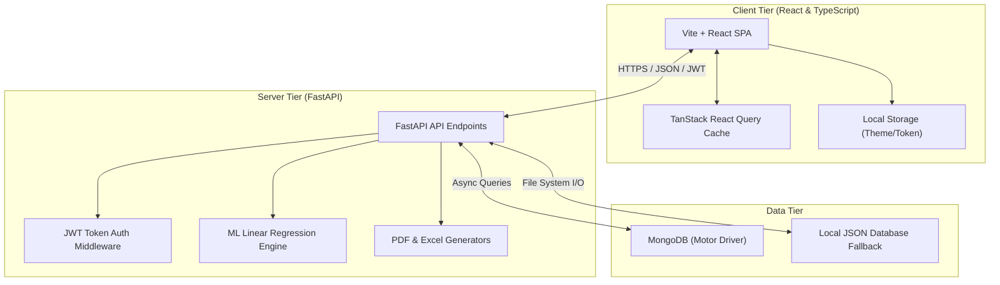
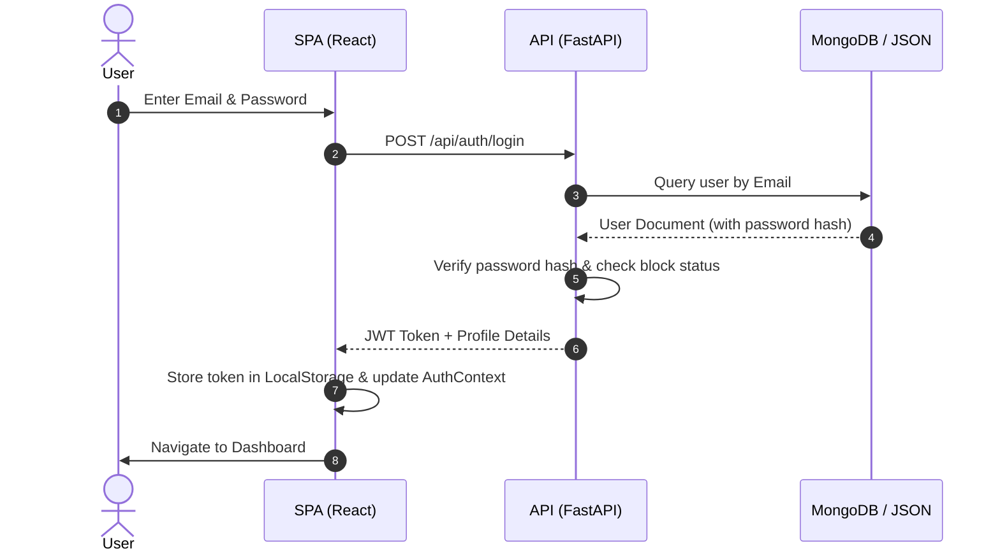
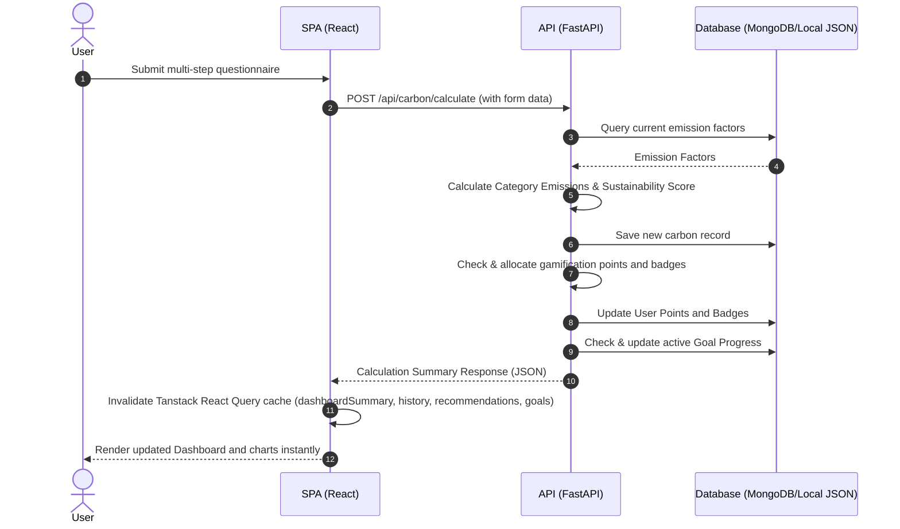

# 🌿 EcoTrack Architecture & Documentation

This document describes the technical architecture, database schemas, and API flows of the EcoTrack application.

---

## 🏗️ 1. Architecture Diagram

EcoTrack utilizes a decoupled three-tier architecture with state caching and offline fallback databases.



---

## 🗄️ 2. Database Schema

EcoTrack supports MongoDB with automatic local file database fallback (`data/*.json`). The collection schemas are structured as follows:

### 👤 `users` Collection
Stores user profiles, roles, and gamification points.
```json
{
  "_id": "string (ObjectId)",
  "name": "string",
  "email": "string",
  "password_hash": "string",
  "role": "string (user | admin)",
  "points": "integer",
  "badges": ["string"],
  "sustainability_score": "integer",
  "profile": {
    "age": "integer",
    "country": "string",
    "city": "string",
    "occupation": "string",
    "household_size": "integer",
    "transportation_preference": "string",
    "sustainability_interests": ["string"]
  },
  "blocked": "boolean",
  "created_at": "datetime"
}
```

### 🌿 `carbon_records` Collection
Contains users' monthly carbon footprint logs.
```json
{
  "_id": "string (ObjectId)",
  "user_id": "string (User Ref)",
  "date": "string (YYYY-MM-DD)",
  "transportation": {
    "car_km": "float",
    "bike_km": "float",
    "public_transit_km": "float",
    "flights_per_year": "float",
    "emission_co2": "float"
  },
  "energy": {
    "electricity_kwh": "float",
    "gas_lpg": "float",
    "renewable_pct": "float",
    "emission_co2": "float"
  },
  "food": {
    "diet_type": "string",
    "meat_servings": "float",
    "food_waste_level": "string",
    "emission_co2": "float"
  },
  "lifestyle": {
    "online_purchases": "float",
    "clothing_purchases": "float",
    "electronics_purchases": "float",
    "waste_generation": "float",
    "emission_co2": "float"
  },
  "total_emission": "float",
  "sustainability_score": "integer",
  "created_at": "datetime"
}
```

### 🎯 `goals` Collection
Contains custom user sustainability reduction targets.
```json
{
  "_id": "string (ObjectId)",
  "user_id": "string (User Ref)",
  "category": "string (transportation | energy | food | lifestyle)",
  "title": "string",
  "target_value": "float",
  "progress": "float",
  "status": "string (active | completed)",
  "deadline": "datetime",
  "created_at": "datetime"
}
```

---

## 🔄 3. API Flow Diagrams

### User Authentication Flow


### Carbon Footprint Calculation & Gamification Flow


---

## 💡 4. Feature Explanation

1. **Carbon Footprint Calculator**: A 5-step wizard dividing emissions metrics into Transportation, Energy, Food, and Lifestyle. It connects to dynamic backend emission factors to compute exact CO2 counts.
2. **TanStack React Query Cache Layer**: Eliminates redundant server queries. State cache invalidation updates charts and statistics immediately after logs, goals, or posts are modified.
3. **ML Carbon Predictor**: Utilizes a trained linear regression model to predict hypothetical emissions changes dynamically using slider controls in the client browser.
4. **Advisory EcoBot Chatbot**: An async AI helper. When keys are present in the environment (`.env`), it queries OpenAI or Gemini models; otherwise, it handles questions locally with a rule-based engine.
5. **Interactive Gamification**: Leaderboards ranking the most eco-conscious users, tracking badges like *Eco Warrior* and rewarding points for sustainable logging and goal completions.
